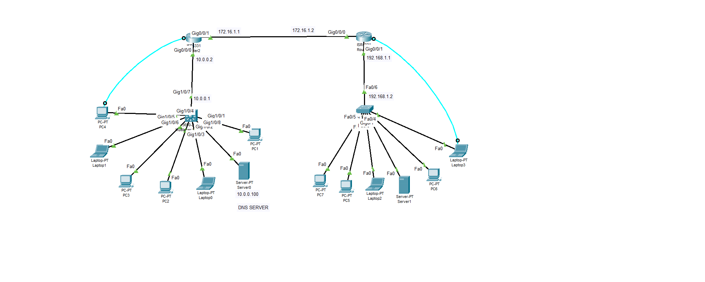

# Basic Router Configuration - CCNA Lab

This project demonstrates a basic but complete router configuration as part of my CCNA-level networking lab exercises. The setup was designed and tested using Cisco Packet Tracer.

## Lab Objective

To configure a router with the following features:
- Hostname and time setup
- Secure user authentication
- Encrypted passwords
- Remote access via VTY and AUX lines
- Banner messages for login and MOTD
- IP address assignment on interfaces
- Domain name and DNS settings
- Basic HTTP server configuration

## Router Configuration Summary

- **Hostname**: `CCNA2`
- **Clock Set**: `07:12, 1 June 2025`
- **Enable Secret Password**: Encrypted (`Adeola123`)
- **Username**: `ccna` with privilege level 15
- **VTY & AUX Access**: Password-protected with local login
- **Domain Name**: `Adeola.com.ng`
- **Name Server**: `192.168.1.100`
- **Default Gateway**: `192.168.1.1`
- **Interface g0/0/0**: `172.16.1.2 /24`
- **Interface g0/0/1**: `192.168.1.2 /24`
- **HTTP Server**: Enabled with local authentication
- **Banners**: MOTD and Login set
- **Security Enhancements**: Password policies, login blocking, and logging

## Configuration Script

The full configuration is saved in [`router2_config.txt`](./router2_config.txt) in this folder.

## Tools Used

- Cisco Packet Tracer
- Cisco IOS CLI

## Preview

  

> Note: Replace the image paths if necessary depending on your folder structure.

## Author

Adeola – Network & Cybersecurity Engineer  
GitHub: [Adblack19](https://github.com/Adblack19)

---

✅ This is part of my growing CCNA lab and cybersecurity home lab portfolio.

